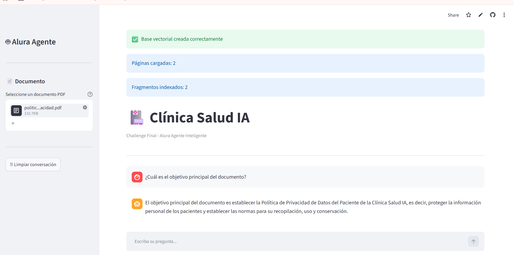
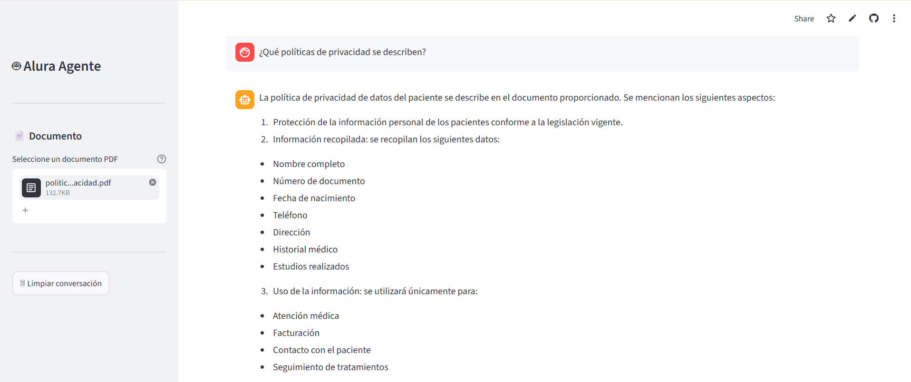
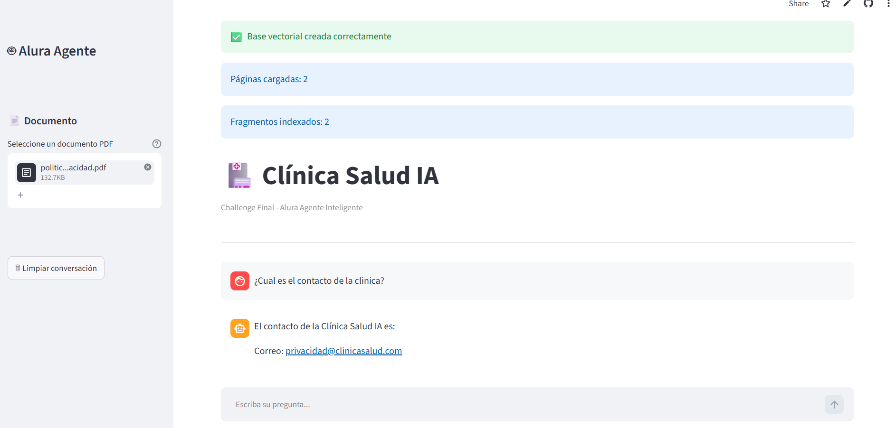

# 📖 Guía de Uso - Clínica Salud IA

Bienvenido a **Clínica Salud IA**, un agente inteligente basado en arquitectura **RAG (Retrieval-Augmented Generation)**, desarrollado para responder preguntas utilizando la información contenida en documentos PDF.

---

# 🌐 Acceso a la Aplicación

La aplicación se encuentra disponible en el siguiente enlace:

**https://alura-agente-clinica-ia-xa3cgsjzknnhprrcdvontb.streamlit.app/**

No es necesario instalar ningún software adicional. Solo debes acceder desde tu navegador web.

---

# 🚀 Pasos para Utilizar la Aplicación

## 1. Ingresar a la aplicación

Abre el enlace de la aplicación desde cualquier navegador compatible.

---

## 2. Cargar un documento PDF

En la parte lateral de la aplicación encontrarás la opción para cargar un archivo PDF.

Haz clic en **"Seleccionar archivo"** y elige el documento que deseas consultar.

> **Importante:** La aplicación únicamente responde preguntas basadas en la información contenida en el documento PDF cargado.

---

## 3. Esperar el procesamiento

Una vez seleccionado el archivo, la aplicación procesará automáticamente el contenido del documento:

* Extracción del texto.
* División en fragmentos.
* Generación de embeddings.
* Creación de la base vectorial FAISS.

Este proceso puede tardar algunos segundos dependiendo del tamaño del documento.

---

## 4. Realizar preguntas

Cuando el procesamiento haya finalizado, podrás escribir preguntas relacionadas con el contenido del documento.

Ejemplos:

* ¿Cuál es el objetivo principal del documento?

* ¿Qué políticas de privacidad se describen?

* ¿Cual es el contacto de la clinica?

---

## 5. Obtener la respuesta

El agente analizará el contenido del documento y generará una respuesta utilizando exclusivamente la información recuperada desde el PDF cargado.

Si la información no existe dentro del documento, el agente indicará que no dispone de información suficiente para responder.

---

# 💡 Recomendaciones

* Utiliza documentos PDF que contengan texto legible.
* Formula preguntas claras y específicas para obtener mejores resultados.
* Si deseas consultar otro documento, carga un nuevo archivo PDF para actualizar la base de conocimiento.

---

# 🛠 Tecnologías Utilizadas

* Python
* Streamlit
* LangChain
* Groq (Llama 3.1 8B Instant)
* Hugging Face Embeddings
* FAISS
* PyPDF
* Arquitectura RAG (Retrieval-Augmented Generation)

---

# 👨‍💻 Autor

**Rodrigo Antonelli**

Proyecto desarrollado como parte del **Challenge Final - Alura Agentes Inteligentes (2026)**.
